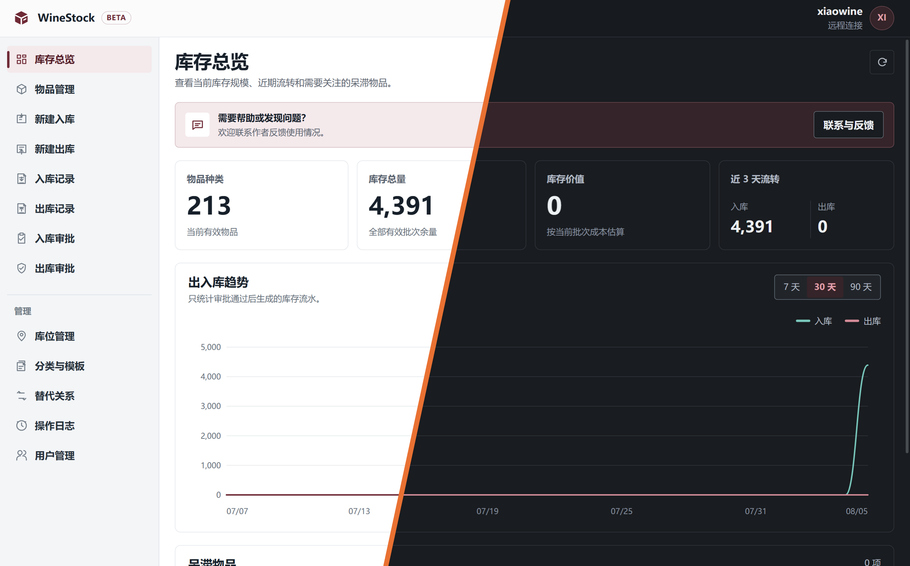
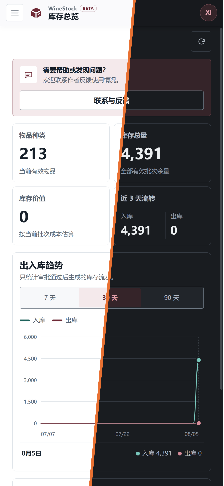

  

  

  

# WineStock

让每一件物品有记录，让每一次流转有依据。

WineStock 把物品、批次、库位、出入库和协作权限放在同一个工作台里。你可以在桌面端集中整理，也可以拿着 Android
设备在现场查看和录入；界面与业务流程始终保持一致。本机使用、连接远程服务，或让多台设备共同工作，都可以按需要选择。

## 界面预览

  

<em>桌面端库存总览：库存规模、库存价值、出入库趋势与需要关注的物品一目了然。</em>

  

<em>Android 端延续相同的业务体验，并为触控和窄屏调整信息布局。</em>

## 你可以用 WineStock 做什么

- **先看清，再行动**：打开总览，就能看到库存规模、近期流转和需要关注的物品。
- **让物品有地方可找**：为物品维护分类、属性、图片、批次和库位信息。
- **把每次进出记完整**：记录数量、批次、库位，并按先进先出原则完成出库。
- **让重要操作多一道确认**：入库和出库可以直接完成，也可以提交审核后再改变库存。
- **让多人协作各有边界**：按照用户权限分配查看、录入、管理和审批能力。
- **让变化留下线索**：通过操作日志回看库存和基础数据的关键变化。
- **按自己的习惯使用**：浅色或深色主题，桌面或移动设备，都保持清晰一致。

## 从一个人的库存，到一群人的协作

WineStock 适合需要持续记录库存变化、明确物品位置，并由一个人或一组成员共同维护数据的场景。

你可以用它来：

- 管理家中、工作室或小型仓库的日常库存，随时知道还剩什么、放在哪里。
- 让采购、仓储和管理人员共享同一份物品目录与出入库记录。
- 在电脑、手机或平板之间连接同一个服务，减少重复录入和信息不同步。
- 用审批和操作日志保留清晰的责任边界，知道谁在什么时候做了什么。

## 一套体验，多个平台

WineStock 共享同一套界面和业务流程，让不同设备之间的切换变得自然：

- 桌面端适合宽屏下的持续操作、批量整理和集中管理。
- Android 端适合触控操作、移动查看和现场录入。
- 浅色和深色主题共享同一套信息层级，切换主题不会改变操作逻辑。
- 换一台设备，不必重新学习一套新的操作方式。

设备差异由应用自身处理，用户始终面对的是熟悉的 WineStock。

## 按你的方式运行

无论是个人使用，还是多人共享，WineStock 都提供相应的运行方式：

| 运行方式     | 说明                                 |
|----------|------------------------------------|
| 仅在本机使用   | 数据保存在当前设备，适合个人使用或单设备管理             |
| 允许其他设备连接 | 当前设备提供共享服务，供同一网络中的其它设备使用           |
| 连接已有服务器  | 当前设备连接已经部署好的远程服务，专注于使用界面           |

具体可用的运行方式由当前平台能力决定。需要多人或多台设备共同使用时，可以让一台设备提供共享服务，其它设备连接到同一个服务。

## 相关文档

- [项目文档入口](docs/README.md)
- [运行与网络配置](docs/runtime-networking.md)
- [平台职责](docs/platforms.md)

## 项目统计

